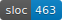

# Acme PCF Specification

## The Problem

[RealWorld](https://github.com/gothinkster/realworld) is a fantastic tool for comparing programming languages, but I'm not very interested in HTTP APIs.

## The Solution

Make RealWorld-like specifications for more things than webapps.

In this case, a tiny programming language called PCF.

## Why PCF

PCF is "Programming Computable Functions", a language by [Gordon Plotkin](https://en.wikipedia.org/wiki/Gordon_Plotkin). He introduced it in a 1977 paper called [LCF Considered as a Programming Language](http://homepages.inf.ed.ac.uk/gdp/publications/LCF.pdf).

It's simply typed lambda calculus with a few extensions. These are a builtin `fix` function for recursion, primative booleans and natural numbers with a handful of operations on them, and if/then/else statements.

This is perfect for our purposes. It's enough features to make implementations exert themselves, but still few enough that it stays a small project.

## Example

Input:
```
let
  add =
    fix
      (\recurse : Nat -> Nat -> Nat.
        \x : Nat. \y : Nat.
          if is-zero x
            then
              y

            else
              recurse (pred x) (suc y))
in
  add 3 4
```

Output:
```
7
```

## Informal specification

This is based off of section 2 of Plotkin's [paper](http://homepages.inf.ed.ac.uk/gdp/publications/LCF.pdf): "2. The programming language, PCF".

Plotkin's paper doesn't provide a concrete syntax, so we make one up.

Additionally, we add two builtins to the language, which is allowed by section 2:

+ `let`: for ease of writing code. It's sugar for abstracting and applying, and not polymorphic.

+ polymorphic `if... then... else`: because having only two monomorphic if/then/else constructs (one that returns `Bool` and one that returns `Nat`) would be sad.

Examples are provided at [./misc/generated/examples.md](./misc/generated/examples.md).

They're also available in [JSON form](./misc/generated/test-cases.json) for building test suites.

## Reference implementation



There's a reference implementation in [./src](./src).

If you start on another implementation let me know. Once you're ready I'll mention it here. I definitely recommend hooking up the [test-cases](./misc/generated/test-cases.json) into your test suite.

TODO: BNF grammar for the language

## Special thanks

This [delightful article](https://jozefg.bitbucket.io/posts/2015-03-24-pcf.html) by Daniel Gratzer ([GitHub repo link](https://github.com/jozefg/pcf)) introduced me to PCF, though he implements different builtins than Plotkin.
