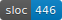

# Reference implementation

The above LOC count is for the language implementation in [./src/Pcf](./src/Pcf). There's also code in [./src/PcfTest](./src/PcfTest) that defines and serializes the example files in [../spec](../spec).
